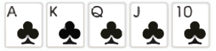
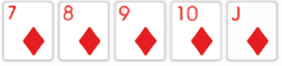
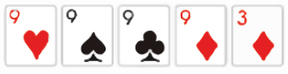
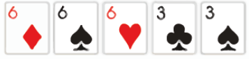
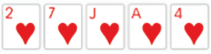
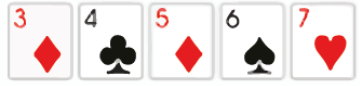
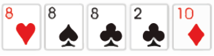
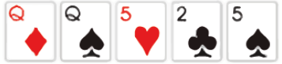
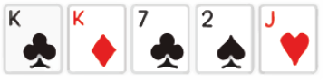
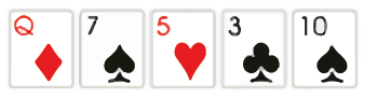

# 🎴 Reglas del Juego

## 1. Sistema de puntuación por ronda

Al iniciar cada ronda, se genera un **score objetivo**, el cual representa el puntaje mínimo que el jugador debe alcanzar para ganar la ronda.

### 1.1 Progresión del score

El score generado en cada ronda es **aleatorio, pero siempre mayor que el de la ronda anterior**.

### 1.2 Rangos de score por ronda

* Ronda 1: [100 - 200]
* Ronda 2: [150 - 300]
* Ronda 3: [250 - 400]
* Ronda 4: [400 - 500]
* Ronda 5 en adelante: [450 - 800]

### 1.3 Cálculo del score

El score se calcula con la siguiente fórmula:

score = rango_min + (random * (rango_max - rango_min))

Donde:

* `random` es un número decimal entre 0 y 1.
* `rango_min` es el valor mínimo del rango de puntaje para la ronda actual.
* `rango_max` es el valor máximo del rango de puntaje para la ronda actual.

Ejemplo (Ronda 1):
Si el rango es [100 - 200] y `random = 0.5`, entonces:

score = 100 + (0.5 * (200 - 100)) = 100 + 50 = 150

---

## 2. Puntaje del jugador

El jugador inicia cada ronda con **0 puntos**.

---

## 3. Reparto de cartas

En cada ronda, el jugador recibe **8 cartas aleatorias** de una baraja estándar de 52 cartas.

---

## 4. Formación de manos

El jugador debe formar manos de poker utilizando las cartas disponibles.

### 🔴 Regla importante:

El jugador debe seleccionar **exactamente 5 cartas** de las 8 disponibles para formar una mano válida.

Las manos posibles son:

* Escalera Real (10, J, Q, K, A del mismo palo)\

* Escalera de Color (5 cartas consecutivas del mismo palo)

* Poker (4 cartas del mismo valor)

* Full House (3 cartas iguales + 1 pareja)

* Color (5 cartas del mismo palo)

* Escalera (5 cartas consecutivas)

* Trío (3 cartas iguales)

* Doble Pareja (2 pares)

* Pareja (2 cartas iguales)

* Carta Alta (ninguna de las anteriores, se puntúa por la carta más alta)

---

## 5. Uso de cartas y descartes

El jugador puede elegir qué cartas usar y cuáles descartar.

### 5.1 Descartes

* El jugador puede realizar un máximo de **3 rondas de descarte por ronda**, donde en cada ronda puede descartar una o más cartas de su mano.
* Cada descarte reemplaza las cartas seleccionadas por nuevas cartas aleatorias.

### 5.2 Restricciones

* Las cartas descartadas no pueden volver a usarse en la misma ronda.
* Las nuevas cartas provienen del mazo restante (sin repetir cartas ya usadas o descartadas).

---

## 6. Sistema de Jokers

Al finalizar cada ronda, el jugador puede elegir **uno de dos jokers disponibles**.

* Cada joker otorga una ventaja o modificación al puntaje.
* El joker seleccionado **solo aplica en la siguiente ronda**.
* Los jokers **no se acumulan**.

---

## 7. Condición de derrota

Si el jugador no alcanza el score objetivo en una ronda, la partida termina (Game Over).

---
(para saber como se calcula el puntaje de cada mano, revisar el archivo [puntajes.md](./puntajes.md))

(para saber más sobre los jokers, revisar el archivo [jokers.md](./jokers.md))

(para saber como jugar revisar el archivo [como_jugar.md](./como_jugar.md))